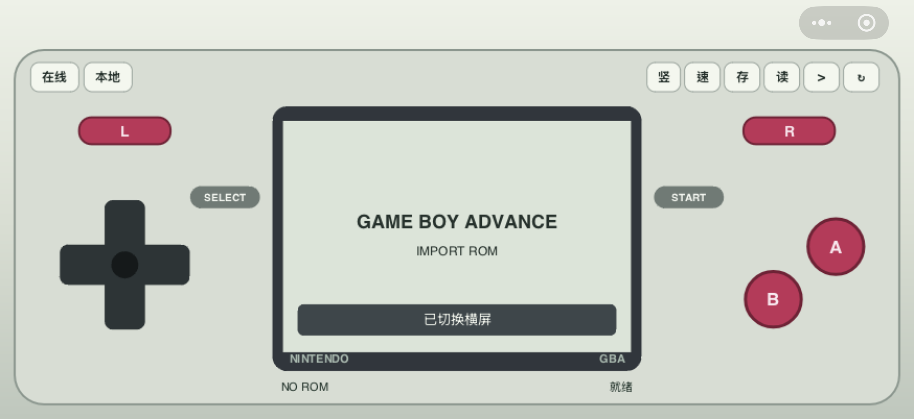

# Nintendo GBA 微信小游戏

中文 | [English](README.md)

一个运行在微信小游戏环境中的 GBA 模拟器实验项目。界面按掌机手感设计，支持竖屏和横屏布局、虚拟按键、在线 ROM、本地 ROM、即时存档、自动电池存档以及声音输出。

模拟核心基于 mGBA WebAssembly，项目入口是 `game.js`，主要逻辑位于 `js/main.js` 和 `js/gba` 目录。

<p align="center">
  
  
</p>

## 功能特性

- GBA 风格操作界面，包含屏幕、方向键、A/B、L/R、START/SELECT。
- 支持竖屏和横屏，横屏会请求切换手机真实屏幕方向。
- 支持在线 ROM 下载，并显示下载进度。
- 支持本地选择 `.gba` ROM。
- 微信开发者工具中可快速读取 `rom` 目录里的调试 ROM，方便开发测试。
- 基于 mGBA WASM 的 GBA 模拟核心。
- 支持真实 16KB GBA BIOS。
- 支持即时存档和即时读档。
- 支持电池存档自动保存到微信本地 storage。
- 支持 WebAudio 声音输出。
- 支持暂停、继续、重启和跳帧性能模式。

## 目录结构

```text
.
├── game.js                     # 微信小游戏入口
├── game.json                   # 小游戏配置
├── project.config.json         # 微信开发者工具项目配置
├── js
│   ├── main.js                 # 主流程、导入 ROM、生命周期、渲染循环
│   ├── render.js               # Canvas 初始化和窗口尺寸适配
│   └── gba
│       ├── audio.js            # 微信小游戏音频输出
│       ├── controls.js         # 触摸控制和虚拟按键
│       ├── emulator.js         # mGBA WASM 适配层
│       ├── layout.js           # 竖屏/横屏布局
│       ├── rom.js              # ROM/BIOS 读取、下载、本地导入
│       ├── rom-config.js       # 在线 ROM/BIOS 配置
│       └── wasm                # mGBA WASM 产物
└── rom                         # 本地开发测试用目录，发布/上传时应忽略
```

## 核心实现原理

项目可以分成三层：微信小游戏外壳、JavaScript 适配层、mGBA WASM 核心。

```text
触摸输入 / 生命周期 / Canvas / WebAudio / 文件系统 / 云下载
                      │
                      ▼
              js/main.js 调度主流程
                      │
                      ▼
       js/gba/emulator.js 适配 mGBA WASM
                      │
                      ▼
          js/gba/wasm/mgba-wechat.wasm
```

### 1. mGBA 到 WASM

GBA 的 CPU、PPU、APU、存档芯片等底层模拟逻辑由 mGBA 负责。项目中 `js/gba/wasm/mgba-wechat.wasm` 是编译后的核心，`js/gba/wasm/mgba-wechat.js` 是 Emscripten 生成的加载胶水代码。

为了让 JavaScript 能驱动模拟器，WASM 核心导出了一组 C 接口，适配层主要调用这些接口：

- `_gba_load_rom`：载入 ROM 和可选 BIOS。
- `_gba_run_frame`：推进一帧 GBA 模拟。
- `_gba_set_keys`：写入当前按键状态。
- `_gba_get_frame_ptr` / `_gba_get_frame_size`：取得当前画面帧缓冲。
- `_gba_pull_audio` / `_gba_get_audio_ptr`：拉取核心产生的音频采样。
- `_gba_export_save` / `_gba_import_save`：导出和导入电池存档。
- `_gba_export_state` / `_gba_import_state`：导出和导入即时存档。

### 2. mGBA WASM 编译方式

当前 WASM 产物不是直接把 mGBA 的桌面程序编译进小游戏，而是把 mGBA 编译成静态库，再用一层很薄的 C bridge 暴露给 JavaScript。

整体流程是：

```text
mGBA 源码
   │
   ├─ Emscripten/CMake 编译出 libmgba.a
   │
   └─ wasm_bridge.c 调用 mGBA core API
          │
          ▼
   emcc 链接 libmgba.a + bridge
          │
          ▼
   mgba-wechat.js + mgba-wechat.wasm
```

bridge 层主要做几件事：

- 创建和销毁 mGBA core。
- 把 JS 传进来的 ROM/BIOS 内存交给 mGBA。
- 每次调用时推进一帧模拟。
- 把 mGBA 的 240 x 160 视频帧转换为 JS 可读的 RGBA 缓冲。
- 把音频采样整理成双声道 `float32` 缓冲。
- 包装电池存档和即时存档的导入/导出。
- 把 JS 的按键 bit mask 转成 mGBA 的按键状态。

一个简化的编译步骤如下。不同 mGBA 版本的 CMake 选项可能会有差异，实际构建时需要按本机工具链和 mGBA 版本微调。

```sh
# 1. 准备 Emscripten 环境，确保 emcc / emcmake / cmake 可用
emcc --version

# 2. 获取 mGBA 源码
git clone --recursive https://github.com/mgba-emu/mgba.git /tmp/mgba-src

# 3. 用 Emscripten 配置 mGBA 静态库构建
emcmake cmake -S /tmp/mgba-src -B /tmp/mgba-build \
  -DCMAKE_BUILD_TYPE=Release \
  -DBUILD_SHARED=OFF \
  -DBUILD_STATIC=ON \
  -DBUILD_QT=OFF \
  -DBUILD_SDL=OFF \
  -DBUILD_GL=OFF \
  -DBUILD_GLES2=OFF \
  -DBUILD_GLES3=OFF \
  -DBUILD_TEST=OFF

# 4. 编译 mGBA 静态库
cmake --build /tmp/mgba-build -j 8

# 5. 链接 bridge 和 libmgba.a，生成微信小游戏使用的 WASM 产物
emcc /tmp/mgba-bridge/wasm_bridge.c /tmp/mgba-build/libmgba.a \
  -I/tmp/mgba-src/include \
  -I/tmp/mgba-build/include \
  -O3 \
  -flto \
  -D_GNU_SOURCE \
  -D_DEFAULT_SOURCE \
  -DPATH_MAX=4096 \
  -DDISABLE_THREADING \
  -s MODULARIZE=1 \
  -s EXPORT_ES6=0 \
  -s ENVIRONMENT=web \
  -s ALLOW_MEMORY_GROWTH=1 \
  -s INITIAL_MEMORY=67108864 \
  -s EXPORTED_FUNCTIONS='["_malloc","_free","_gba_load_rom","_gba_unload","_gba_set_keys","_gba_reset","_gba_run_frame","_gba_get_frame_ptr","_gba_get_frame_size","_gba_get_width","_gba_get_height","_gba_get_frame_count","_gba_pull_audio","_gba_get_audio_ptr","_gba_get_audio_frame_count","_gba_get_audio_sample_rate","_gba_export_save","_gba_get_save_ptr","_gba_get_save_size","_gba_import_save","_gba_export_state","_gba_get_state_ptr","_gba_get_state_size","_gba_import_state"]' \
  -s EXPORTED_RUNTIME_METHODS='["HEAPU8"]' \
  -o js/gba/wasm/mgba-wechat.js
```

这里几个 Emscripten 参数比较关键：

- `MODULARIZE=1`：让生成物以工厂函数形式导出，便于在 `emulator.js` 中异步初始化。
- `EXPORT_ES6=0`：生成 CommonJS/普通脚本风格代码，适配微信小游戏构建环境。
- `ENVIRONMENT=web`：让 Emscripten 按 Web 环境生成运行时代码。
- `ALLOW_MEMORY_GROWTH=1`：允许 WASM 内存增长，降低加载较大 ROM 或存档时的内存不足风险。
- `INITIAL_MEMORY=67108864`：初始内存 64MB，减少运行时频繁扩容。
- `EXPORTED_FUNCTIONS`：只导出 JS 适配层需要调用的函数，避免暴露过多符号。
- `EXPORTED_RUNTIME_METHODS=["HEAPU8"]`：让 JS 能访问 WASM 线性内存，用于拷贝 ROM、BIOS、画面、声音和存档数据。

生成后需要把 `mgba-wechat.js` 和 `mgba-wechat.wasm` 放到 `js/gba/wasm`。`emulator.js` 会读取 `js/gba/wasm/mgba-wechat.wasm`，并通过 `mgba-wechat.js` 创建模块实例。

如果你准备长期维护这个项目，建议把 `wasm_bridge.c` 和构建脚本纳入仓库，例如放到 `tools/mgba-wasm/`。这样别人可以重新编译 WASM，而不是只依赖当前已经生成好的二进制产物。

### 3. 微信小游戏环境适配

微信小游戏不是完整浏览器环境，所以 `js/gba/emulator.js` 会补齐一部分运行时能力，例如 `document`、`performance`、`crypto`、`WebAssembly` 等最小 shim。

WASM 加载会优先尝试微信运行时提供的 `WXWebAssembly.instantiate`。如果不可用或失败，再读取随包的 `.wasm` 二进制，并使用标准 `WebAssembly.instantiate` 兜底。

ROM 和 BIOS 读取由 `js/gba/rom.js` 处理：

- 在线模式：通过 `wx.downloadFile` 或 `wx.cloud.downloadFile` 下载 ROM，并把进度回调给界面显示。
- 本地模式：通过 `wx.chooseMessageFile` 选择聊天文件中的 `.gba` / `.bin` / `.rom`。
- 开发者工具模式：优先尝试读取本地调试 ROM，减少反复网络下载。
- BIOS：可通过 `js/gba/gba_bios.bin`、云存储、HTTPS，或 `js/gba/bundled-bios.js` 中的可选内嵌值加载。仓库里保留的 `bundled-bios.js` 是空占位文件。

### 4. 帧循环与画面渲染

GBA 原始分辨率是 240 x 160，理论刷新率约 59.7275 FPS。`GBAEmulatorAdapter` 内部用 `requestAnimationFrame` 驱动模拟循环，并维护一个按 GBA 帧时间累积的 `frameBudget`。

每次 tick 时，适配层会根据预算调用一次或多次 `_gba_run_frame`。这样可以在设备短暂卡顿后补帧，但最多限制为一次 tick 追 4 帧，避免主线程被长时间占满。

一帧模拟完成后，适配层从 WASM 内存中读取 240 x 160 的 RGBA 帧缓冲，复制到 `ImageData`。实际绘制时再根据当前布局把画面缩放到屏幕区域，并关闭 `imageSmoothingEnabled`，保留像素风格。

跳帧模式不会减少核心运行帧数，而是减少画面帧缓冲拷贝和 Canvas 绘制次数；音频仍会持续拉取，尽量保持游戏逻辑和声音节奏稳定。

### 5. 输入映射

`js/gba/controls.js` 负责把触摸点映射到虚拟按键。按键状态在 JavaScript 中压成一个 bit mask：

- A/B/SELECT/START
- 方向键上下左右
- L/R

当触摸开始、移动、结束时，适配层调用 `_gba_set_keys(mask)` 把当前输入状态同步给 WASM 核心。这样核心每帧读取到的就是完整的 GBA 按键状态。

### 6. 音频输出

mGBA 核心会生成双声道 PCM 浮点采样。每帧运行后，`emulator.js` 调用 `_gba_pull_audio` 获取本轮产生的采样数量，再从 WASM 内存中读取音频数据。

`js/gba/audio.js` 使用 `wx.createWebAudioContext` 创建 WebAudio 上下文，把核心采样重采样到设备输出采样率，然后通过 `AudioBufferSourceNode` 排队播放。为了降低延迟，音频队列上限控制得比较小，积压过多时会主动把播放时间拉回到当前时间附近。

### 7. 存档机制

项目有两套存档：

- 电池存档：对应卡带里的 SRAM/FLASH/EEPROM。核心导出后转成 base64，写入 `wx.setStorageSync`。模拟器暂停、切 ROM、运行约 300 帧后都会尝试保存。
- 即时存档：保存完整模拟器状态，包括 CPU、内存、PPU/APU 状态和相关元数据。点击 `存` 时导出，点击 `读` 时恢复。

存档 key 使用 ROM 文件长度和内容 hash 生成，所以不同 ROM 不会因为文件名相同而互相覆盖。

### 8. 布局和设备方向

`js/gba/layout.js` 根据 Canvas 的宽高判断当前是竖屏还是横屏，并计算屏幕、按键、状态栏和顶部命令按钮的位置。点击 `横` / `竖` 时，`main.js` 会调用 `wx.setDeviceOrientation` 请求微信切换真实设备方向；窗口尺寸变化后再重新计算布局。

## 运行方式

1. 安装并打开微信开发者工具。
2. 选择“小游戏”，导入本项目目录。
3. 编译运行。
4. 点击 `在线` 下载 `js/gba/rom-config.js` 中配置的 ROM，或点击 `本地` 从微信文件选择 `.gba` ROM。
5. 点击 `横` / `竖` 切换屏幕方向。
6. 点击 `存` / `读` 使用即时存档和即时读档。
7. 点击 `速` 切换跳帧性能模式。

## 在线 ROM 配置

代码包不适合内置大型 ROM。开发和测试时，可以把 ROM 上传到微信云开发存储，或放到自己的 HTTPS 下载地址，然后修改 `js/gba/rom-config.js`：

```js
export const ROM_SOURCE = {
  name: 'default.gba',
  cloudEnv: '你的云环境 ID',
  cloudFileID: 'cloud://...',
  httpsUrl: '',
  preferHttps: true,
  bundledBiosPath: '',
  biosCloudFileID: '',
  biosHttpsUrl: '',
};
```

配置说明：

- `name`：ROM 显示名称。
- `cloudEnv`：微信云开发环境 ID。
- `cloudFileID`：云存储里的 ROM fileID。
- `httpsUrl`：普通 HTTPS ROM 下载地址。
- `preferHttps`：为 `true` 时优先使用 `httpsUrl`，失败后再尝试云存储。
- `bundledBiosPath`：可选的随包 BIOS 路径。
- `biosCloudFileID` / `biosHttpsUrl`：可选的云端或 HTTPS BIOS 地址。

如果使用普通 HTTPS 地址，需要在微信小程序后台配置 `downloadFile` 合法域名。开发者工具里可以临时关闭合法域名校验，但真机和正式版需要正确配置域名。

## 本地开发 ROM

开发者工具中点击 `在线` 时，项目会优先尝试读取本地 `rom` 目录里的调试 ROM，这样不用每次都走网络下载。

`rom` 目录只用于本地开发测试，已经在 `project.config.json` 的上传忽略列表中。开源或发布前，请不要提交任何你没有分发权的 ROM 文件。

## BIOS

真实 GBA BIOS 必须是 16KB，也就是 16384 字节。为了开源安全，这个仓库不包含真实 BIOS 数据。`js/gba/bundled-bios.js` 会作为空占位文件保留，避免 import 路径失效。

使用者可以通过配置 `bundledBiosPath`、`biosCloudFileID`、`biosHttpsUrl`，或在本地开发时私下替换占位文件，来使用自己合法获得的 BIOS。

## 存档

项目包含两类存档：

- 电池存档：模拟卡带 SRAM/FLASH/EEPROM，自动保存到微信本地 storage。
- 即时存档：通过界面上的 `存` / `读` 按钮保存和恢复完整模拟器状态。

存档 key 会根据 ROM 内容生成，同名但内容不同的 ROM 不会互相覆盖。

## 性能说明

手机端性能主要受设备、微信运行时、WASM 性能和音频输出影响。项目提供跳帧模式用于性能不足的设备：

- 原始画面
- 跳 2 帧
- 跳 4 帧
- 跳 6 帧

一般情况下，mGBA WASM 在较新的手机上可以接近 60 FPS。低端设备可能需要开启跳帧。

## 开源前检查清单

- 移除或替换所有商业 ROM。
- 除非有明确分发权，否则不要把真实 BIOS 文件提交到 git。
- 将 `js/gba/rom-config.js` 中的云环境、fileID、HTTPS 地址替换为你自己的合法资源，或改为空配置。
- 在仓库中添加合适的开源许可证，例如 `MIT`、`GPL` 或其他与你使用的模拟核心兼容的许可证。
- 检查 `project.config.json` 中的 `appid`，必要时改成自己的测试 AppID。

## 版权与免责声明

本项目仅用于学习、研究微信小游戏和 GBA 模拟器移植技术。请只使用你拥有合法使用权的 ROM 和 BIOS 文件。项目不提供任何商业游戏 ROM，也不鼓励或支持未经授权的游戏分发。

mGBA 及相关依赖有各自的开源许可证。正式开源或发布前，请确认你的项目许可证与所有依赖许可证兼容。
